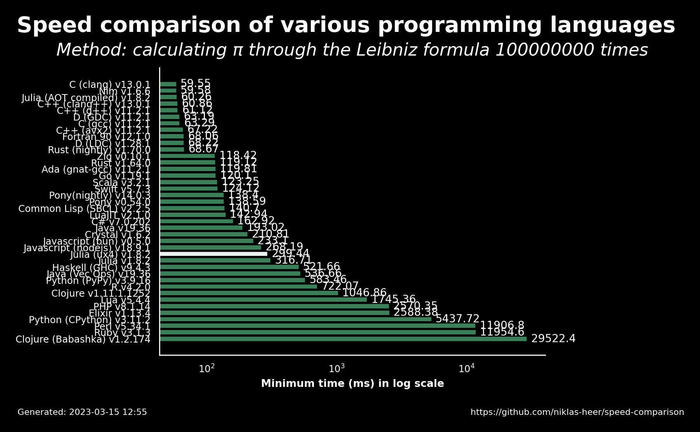

# 2023-03-15 12:55:48

## Speed comparison results

These are the latest speed comparison results of various programming languages.

### Raw results

| name                 | version     | median   | min      | max      | accuracy |
| -------------------- | ----------- | -------- | -------- | -------- | -------- |
| C (clang)            | 13.0.1      | 61.7     | 59.55    | 68.22    | 8.4972   |
| Nim                  | 1.6.6       | 61.28    | 59.58    | 67.76    | 8.4975   |
| Julia (AOT compiled) | 1.8.2       | 60.5     | 60.26    | 60.85    | 8.4971   |
| C++ (clang++)        | 13.0.1      | 67.24    | 60.86    | 68.01    | 8.4972   |
| C++ (g++)            | 11.2.1      | 61.27    | 61.12    | 62.85    | 8.4968   |
| D (GDC)              | 11.2.1      | 67.65    | 63.19    | 68.22    | 8.4968   |
| C (gcc)              | 11.2.1      | 67.26    | 63.29    | 67.86    | 8.4968   |
| C++ (avx2)           | 11.2.1      | 67.48    | 67.22    | 68.76    | 8.4969   |
| Fortran 90           | 12.1.0      | 68.14    | 68.06    | 68.59    | 8.4972   |
| D (LDC)              | 1.28.1      | 68.42    | 68.22    | 68.77    | 8.4972   |
| Rust (nightly)       | 1.70.0      | 68.73    | 68.67    | 69.56    | 8.497    |
| Zig                  | 0.10.1      | 118.55   | 118.42   | 135.82   | 8.4972   |
| Rust                 | 1.64.0      | 119.84   | 119.12   | 135.92   | 8.4972   |
| Ada (gnat-gcc)       | 11.2.1      | 121.79   | 119.81   | 136.33   | 8.4971   |
| Go                   | 1.19.1      | 120.19   | 120.1    | 136.9    | 8.4972   |
| Scala                | 3.2.1       | 137.76   | 123.25   | 137.9    | 8.4972   |
| Swift                | 5.7.3       | 124.44   | 124.12   | 124.71   | 8.4971   |
| Pony(nightly)        | 14.0.3      | 139.18   | 138.4    | 139.2    | 8.4972   |
| Pony                 | 0.54.0      | 139.04   | 138.59   | 139.04   | 8.4972   |
| Common Lisp (SBCL)   | 2.2.5       | 142.17   | 140.7    | 142.49   | 8.4972   |
| LuaJIT               | 2.1.0       | 160.06   | 142.94   | 160.57   | 8.4971   |
| C#                   | 7.0.202     | 181.0    | 162.92   | 184.97   | 8.4972   |
| Java                 | 19.36       | 194.65   | 193.02   | 194.97   | 8.4972   |
| Crystal              | 1.6.2       | 236.4    | 210.81   | 237.15   | 8.4971   |
| Javascript (bun)     | 0.5.0       | 257.7    | 233.1    | 260.66   | 8.4972   |
| Javascript (nodejs)  | 18.9.1      | 269.07   | 268.19   | 269.89   | 8.4972   |
| Julia (ux4)          | 1.8.2       | 302.77   | 299.44   | 324.93   | 5.534    |
| Julia                | 1.8.2       | 320.9    | 316.71   | 350.55   | 8.4971   |
| Haskell (GHC)        | 9.4.3       | 531.62   | 521.66   | 531.7    | 8.4972   |
| Java (Vec Ops)       | 19.36       | 549.2    | 536.66   | 557.52   | 8.4972   |
| Python (PyPy)        | 3.9.16      | 584.57   | 583.46   | 586.86   | 8.4972   |
| R                    | 4.2.0       | 731.44   | 722.07   | 731.89   | 8.4971   |
| Clojure              | 1.11.1.1252 | 1091.91  | 1046.86  | 1159.3   | 8.4972   |
| Lua                  | 5.4.4       | 1747.14  | 1745.36  | 1987.83  | 8.4971   |
| PHP                  | 8.1.14      | 2632.06  | 2570.35  | 2912.44  | 8.4972   |
| Elixir               | 1.13.4      | 2611.24  | 2588.38  | 2927.08  | 8.4326   |
| Python (CPython)     | 3.11.2      | 5442.0   | 5437.72  | 5459.03  | 8.4972   |
| Perl                 | 5.34.1      | 11918.83 | 11906.75 | 13724.71 | 8.4971   |
| Ruby                 | 3.1.3       | 12599.54 | 11954.63 | 12801.0  | 8.4971   |
| Clojure (Babashka)   | 1.2.174     | 29532.9  | 29522.36 | 29734.47 | 8.4972   |
